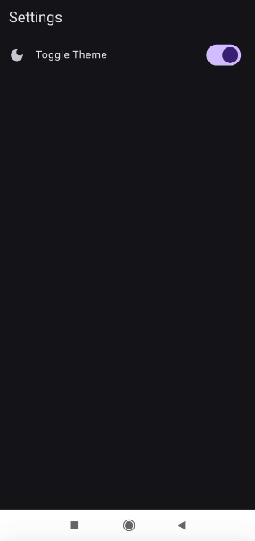
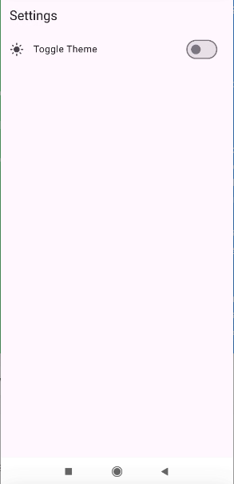

# Flutter Dark Theme Toggle App

A simple Flutter app that allows users to toggle between light and dark themes. This app demonstrates how to implement a theme switcher in a Flutter application using Dart. The user can change the theme of the app dynamically with a Switch Widget.

## Features
- Toggle between light and dark themes.
- The theme setting persists even after the app is closed and reopened.
- Responsive UI designed for both mobile phones and tablets.
- Smooth transition between themes.

## Screenshots

  

## Usage

- Open the app and you'll see a button on the Settings screen labeled "Toggle Theme."
- Tap the button to switch between light and dark themes.

## Technologies Used

- **Flutter**: A UI toolkit for building natively compiled applications for mobile, web, and desktop from a single codebase.
- **Dart**: The programming language used to develop the Flutter app.
- **Shared Preferences**: For saving the user's theme preference persistently.

